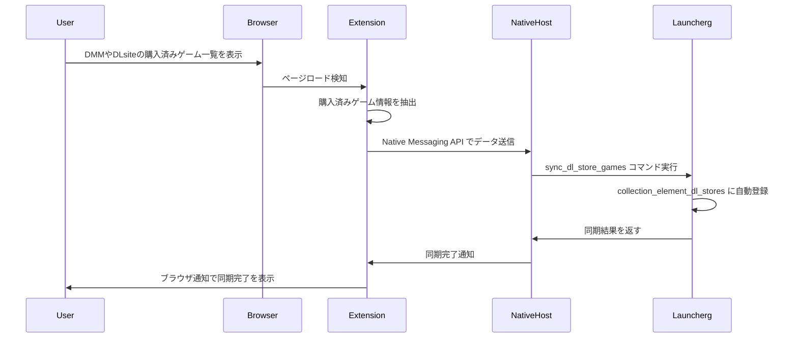
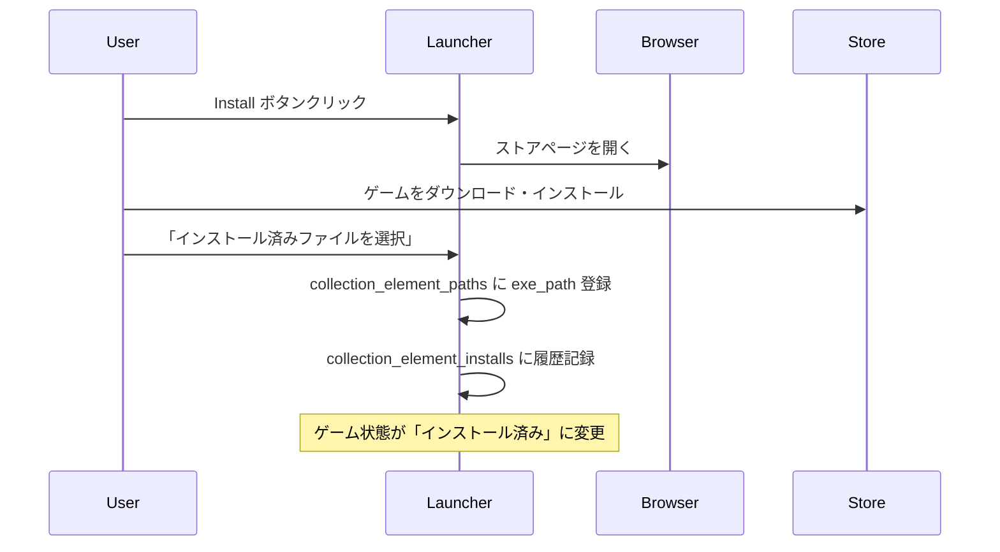

# DL版ゲーム管理機能デザインドキュメント

## 概要

Launchergにおいて、DMMやDLsiteで購入したダウンロード版ゲームを管理し、ユーザーが購入済みゲームのインストール・起動を効率的に行えるようにする機能を設計する。

## 目標

- 購入済みDL版ゲームのリスト表示
- 未インストールゲームに対するInstallボタンの提供
- インストール済みゲームに対するPlayボタンの提供
- ブラウザベースでのデータ同期（認証情報を保持しない）

## システム要件

### 機能要件

1. **DL版ゲーム情報の管理**
   - 購入済みゲームのメタデータ保存
   - インストール状態の追跡
   - 販売サイト情報の関連付け

2. **UI/UX**
   - 既存のPlayボタンと統一された見た目のInstallボタン
   - インストール状態に応じたボタンの自動切り替え
   - 購入済みゲームの視覚的識別

3. **ブラウザ連携**
   - DMMやDLsiteのゲームページへの直接リンク
   - ユーザーが手動でダウンロード・インストールを実行

### 非機能要件

- セキュリティ：認証情報を保持しない
- プライバシー：ユーザーの購入履歴は本人が管理
- 拡張性：新しい販売サイトの追加が容易

## アーキテクチャ設計

### 現在のCollectionElementアーキテクチャ

現在のLaunchergは、ゲーム管理において非常に優れた設計を採用しています：

- `CollectionElement`: ゲームの基本エンティティ（id, created_at, updated_atのみ）
- 関連情報は専用テーブルに分離：
  - `collection_element_info_by_erogamescape`: ゲーム情報
  - `collection_element_paths`: ファイルパス情報
  - `collection_element_installs`: インストール履歴
  - `collection_element_plays`: プレイ履歴
  - `collection_element_likes`: いいね履歴
  - `collection_element_thumbnails`: サムネイル情報

### データモデル設計

既存のパターンに従い、DL版ゲーム情報も関連エンティティとして追加します。

#### CollectionElementDLStore（新規）
```rust
#[derive(new, Debug, Clone, Serialize, Deserialize, PartialEq)]
#[serde(rename_all = "camelCase")]
pub struct CollectionElementDLStore {
    pub id: Id<CollectionElementDLStore>,
    pub collection_element_id: Id<CollectionElement>,
    pub store_id: String,        // DMMやDLsiteでのゲームID
    pub store_type: DLStoreType,
    pub store_name: String,      // 表示用ストア名
    pub purchase_url: String,    // ゲームページのURL
    pub is_owned: bool,          // 購入済みかどうか
    pub purchase_date: Option<DateTime<Local>>, // 購入日（わかる場合）
    pub created_at: DateTime<Local>,
    pub updated_at: DateTime<Local>,
}

#[derive(Debug, Clone, Serialize, Deserialize, PartialEq)]
pub enum DLStoreType {
    DMM,
    DLSite,
    // 将来的にSteam, Epic等も追加可能
}
```

#### CollectionElement構造拡張
```rust
pub struct CollectionElement {
    pub id: Id<CollectionElement>,
    pub created_at: DateTime<Local>,
    pub updated_at: DateTime<Local>,
    // 関連データ
    pub info: Option<CollectionElementInfo>,
    pub paths: Option<CollectionElementPaths>,
    pub install: Option<CollectionElementInstall>,
    pub play: Option<CollectionElementPlay>,
    pub like: Option<CollectionElementLike>,
    pub thumbnail: Option<CollectionElementThumbnail>,
    pub dl_store: Option<CollectionElementDLStore>, // 新規追加
}

// CollectionElementにインストール状態判定メソッドを追加
impl CollectionElement {
    pub fn install_status(&self) -> GameInstallStatus {
        match (&self.paths, &self.dl_store) {
            // パス情報がある場合はインストール済み
            (Some(paths), _) if paths.exe_path.is_some() || paths.lnk_path.is_some() => {
                GameInstallStatus::Installed
            }
            // DL版を所有しているがパス情報がない場合
            (None, Some(dl_store)) if dl_store.is_owned => {
                GameInstallStatus::OwnedNotInstalled
            }
            // その他は未所有
            _ => GameInstallStatus::NotOwned,
        }
    }

    pub fn can_play(&self) -> bool {
        matches!(self.install_status(), GameInstallStatus::Installed)
    }

    pub fn can_install(&self) -> bool {
        matches!(self.install_status(), GameInstallStatus::OwnedNotInstalled)
    }
}

#[derive(Debug, Clone, PartialEq)]
pub enum GameInstallStatus {
    Installed,           // プレイ可能
    OwnedNotInstalled,   // インストール可能
    NotOwned,           // 購入していない
}
```

### データベース設計

#### 新規テーブル：collection_element_dl_stores
```sql
CREATE TABLE IF NOT EXISTS collection_element_dl_stores (
    id INTEGER PRIMARY KEY AUTOINCREMENT,
    collection_element_id INTEGER NOT NULL,
    store_id TEXT NOT NULL,
    store_type TEXT NOT NULL, -- 'DMM', 'DLSite'
    store_name TEXT NOT NULL,
    purchase_url TEXT NOT NULL,
    is_owned BOOLEAN NOT NULL DEFAULT FALSE,
    purchase_date DATETIME,
    created_at DATETIME DEFAULT CURRENT_TIMESTAMP,
    updated_at DATETIME DEFAULT CURRENT_TIMESTAMP,
    UNIQUE(collection_element_id, store_id, store_type),
    FOREIGN KEY(collection_element_id) REFERENCES collection_elements(id) ON DELETE CASCADE
);
```

### 統合的なゲーム状態管理

この設計により、1つのゲームに対して以下の状態管理が可能になります：

#### ゲームの存在形態パターン
1. **ローカルのみ**: `collection_element_paths`のみ存在
2. **DL版のみ**: `collection_element_dl_stores`のみ存在
3. **両方**: 両方のテーブルにデータが存在（同じゲームを複数形態で所有）

#### インストール状態の判定ロジック
1. `collection_element_paths.exe_path`または`lnk_path`が存在 → インストール済み
2. `collection_element_dl_stores.is_owned = true`かつパス情報なし → 未インストール
3. 上記以外 → 購入していない/情報なし

#### ボタン表示ロジック
- **Playボタン**: インストール済みの場合
- **Installボタン**: DL版を所有しているが未インストールの場合
- **非表示**: 所有していない場合

### バックエンド実装

#### Repository層
既存の`CollectionRepository`を拡張してDL版情報を扱います：

```rust
// domain/repository/collection.rs
pub trait CollectionRepository {
    // 既存メソッド...

    // DL版情報関連の新規メソッド
    async fn create_dl_store(&self, dl_store: &NewCollectionElementDLStore) -> Result<CollectionElementDLStore>;
    async fn find_dl_store_by_collection_element_id(&self, id: Id<CollectionElement>) -> Result<Option<CollectionElementDLStore>>;
    async fn update_dl_store(&self, dl_store: &CollectionElementDLStore) -> Result<()>;
    async fn delete_dl_store(&self, id: Id<CollectionElementDLStore>) -> Result<()>;
    async fn find_uninstalled_owned_games(&self) -> Result<Vec<CollectionElement>>;
}
```

#### UseCase層
既存の`CollectionUseCase`を拡張：

```rust
// usecase/collection.rs
impl CollectionUseCase {
    // DL版ゲーム登録
    pub async fn register_dl_store_game(&self, request: RegisterDLStoreGameRequest) -> Result<()> {
        // 既存のcollection_elementを検索または作成
        // DL版情報を登録
    }
}

```

#### Interface層
Tauriコマンドを追加：

```rust
// interface/command.rs
#[tauri::command]
pub async fn get_collection_elements(app_handle: AppHandle) -> Result<Vec<CollectionElement>, String> {
    // 既存のコレクション取得メソッドを使用し、dl_store情報も含める
}

#[tauri::command]
pub async fn register_dl_store_game(
    app_handle: AppHandle,
    store_type: String,
    store_id: String,
    game_title: String,
    purchase_url: String
) -> Result<(), String> {
    // DL版ゲームを登録
}

#[tauri::command]
pub async fn open_store_page(purchase_url: String) -> Result<(), String> {
    // ブラウザでストアページを開く
    open::that(purchase_url).map_err(|e| e.to_string())
}

#[tauri::command]
pub async fn link_installed_game(
    app_handle: AppHandle,
    collection_element_id: i64,
    exe_path: String
) -> Result<(), String> {
    // インストール済みゲームとDL版情報を関連付け
}
```

### フロントエンド実装

#### 既存コンポーネント拡張

1. **PlayButton.svelte拡張**
   既存のPlayButtonコンポーネントにゲーム状態に応じたボタン表示機能を追加：

   ```typescript
   // props
   export let collectionElement: CollectionElement
   export let gameStatus: 'installed' | 'owned-not-installed' | 'not-owned'

   // ボタン表示ロジック
   $: buttonConfig = getButtonConfig(gameStatus, collectionElement)

   function getButtonConfig(status: string, element: CollectionElement) {
     switch (status) {
       case 'installed':
         return { text: 'Play', action: () => playGame(element), variant: 'primary' }
       case 'owned-not-installed':
         return { text: 'Install', action: () => openStorePage(element.dl_store.purchase_url), variant: 'secondary' }
       default:
         return null // ボタンを表示しない
     }
   }
   ```

2. **Work.svelte拡張**
   DL版情報を表示するセクションを追加：

   ```svelte
   <!-- 既存のゲーム情報表示に加えて -->
   {#if work.dl_store}
     <div class='dl-store-info'>
       <h3>DL版情報</h3>
       <p>ストア: {work.dl_store.store_name}</p>
       <p>購入日: {work.dl_store.purchase_date || '不明'}</p>
       {#if work.dl_store.is_owned && !isInstalled}
         <LinkButton href={work.dl_store.purchase_url} target='_blank'>
           ストアページを開く
         </LinkButton>
       {/if}
     </div>
   {/if}
   ```

#### 新規コンポーネント

1. **DLStoreManager.svelte**
   DL版ゲームの一括管理画面：

   ```svelte
   <script lang='ts'>
     import { invoke } from '@tauri-apps/api/tauri'

     let uninstalledGames: GameWithStatus[] = []
     let newGameForm = { storeType: 'DMM', storeId: '', gameTitle: '', purchaseUrl: '' }

     async function loadUninstalledGames() {
       uninstalledGames = await invoke('get_uninstalled_owned_games')
     }

     async function registerNewGame() {
       await invoke('register_dl_store_game', newGameForm)
       await loadUninstalledGames()

   </script>

   <div class='dl-store-manager'>
     <section>
       <h2>未インストールの購入済みゲーム</h2>
       {#each uninstalledGames as game}
         <div class='game-item'>
           <span>{game.info?.gamename || 'タイトル不明'}</span>
           <Button on:click={() => invoke('open_store_page', { purchaseUrl: game.dl_store.purchase_url })}>
             Install
           </Button>
         </div>
       {/each}
     </section>

     <section>
       <h2>新しいDL版ゲームを追加</h2>
       <!-- ゲーム登録フォーム -->
     </section>
   </div>
   ```

2. **InstallDetector.svelte**
   インストール検出とパス関連付け機能：

   ```svelte
   <script lang='ts'>
     import { open } from '@tauri-apps/api/dialog'
     import { invoke } from '@tauri-apps/api/tauri'

     export let collectionElementId: number

     async function selectInstallPath() {
       const selected = await open({
         filters: [{ name: 'Executable', extensions: ['exe'] }]
],
       }

       if (selected) {
         await invoke('link_installed_game', {
           collectionElementId,
           exePath: selselected,
         }
          成功通知とUI更新
       }
     }
   </script>

   <Button on:click={selectInstallPath}>
     インストール済みファイルを選択
   </Button>
   ```

### データ同期フロー

## ブラウザ拡張機能による自動同期

### 概要

ユーザーの利便性を向上するため、ブラウザ拡張機能を開発してDMM・DLsiteでの購入済みゲーム情報を自動的にLaunchergに同期する機能を実装します。

### アーキテクチャ

#### 1. ブラウザ拡張機能 (Browser Extension)
```
Launcher Extension/
├── manifest.json (拡張機能設定)
├── content-scripts/
│   ├── dmm-games.js (DMMゲームページ用)
│   └── dlsite.js (DLsiteページ用)
├── background/
│   └── background.js (バックグラウンド処理)
└── popup/
    ├── popup.html (設定UI)
    └── popup.js (設定ロジック)
```

#### 2. 通信プロトコル設計

**Native Messaging API使用**
- ブラウザ拡張機能とデスクトップアプリ間の安全な通信
- JSONベースのメッセージ交換
- Tauriアプリが対応するNative Messaging Host

```json
// メッセージフォーマット例
{
  "type": "game_data_sync",
  "store": "DMM" | "DLSite",
  "games": [
    {
      "store_id": "game_12345",
      "title": "ゲームタイトル",
      "purchase_url": "https://...",
      "purchase_date": "2024-01-15",
      "thumbnail_url": "https://..."
    }
  ]
}
```

#### 3. 拡張機能の動作仕様

**Content Scripts**
```javascript
// content-scripts/dmm-games.js
class DMMGameExtractor {
  extractPurchasedGames() {
    // DOMから購入済みゲーム情報を抽出
    const gameElements = document.querySelectorAll('.purchased-game-item')
    return Array.from(gameElements).map(element => ({
      store_id: this.extractGameId(element),
      title: this.extractTitle(element),
      purchase_url: this.extractUrl(element),
      thumbnail_url: this.extractThumbnail(element)
    }))
  }

  detectPageType() {
    // 購入済みゲーム一覧ページかどうかを判定
    return window.location.href.includes('/library')
      || document.querySelector('.library-container')
  }

  sendToLauncher(games) {
    // Background scriptに送信
    chrome.runtime.sendMessage({
      type: 'sync_games',
      store: 'DMM',
      games
    })
  }
}

// ページロード時に実行
if (document.readyState === 'loading') {
  document.addEventListener('DOMContentLoaded', initExtractor)
}
else {
  initExtractor()
}

function initExtractor() {
  const extractor = new DMMGameExtractor()
  if (extractor.detectPageType()) {
    const games = extractor.extractPurchasedGames()
    if (games.length > 0) {
      extractor.sendToLauncher(games)
    }
  }
}
```

**Background Script**
```javascript
// background/background.js
chrome.runtime.onMessage.addListener((message, sender, sendResponse) => {
  if (message.type === 'sync_games') {
    sendToNativeApp(message)
  }
})

async function sendToNativeApp(data) {
  try {
    const response = await chrome.runtime.sendNativeMessage(
      'com.launcherg.native_host',
      {
        type: 'game_data_sync',
        store: data.store,
        games: data.games
      }
    )
    console.log('Sync successful:', response)
  }
  catch (error) {
    console.error('Sync failed:', error)
  }
}
```

#### 4. Tauri側の実装

**Native Messaging Host設定**
```json
// native-messaging-host/manifest.json
{
  "name": "com.launcherg.native_host",
  "description": "Launcherg Native Messaging Host",
  "path": "C:\\Program Files\\Launcherg\\native-host.exe",
  "type": "stdio",
  "allowed_origins": [
    "chrome-extension://[extension-id]/"
  ]
}
```

**Tauriコマンド拡張**
```rust
#[tauri::command]
pub async fn sync_dl_store_games(
    app_handle: AppHandle,
    store_type: String,
    games_data: Vec<DLStoreGameData>
) -> Result<SyncResult, String> {
    let usecase = get_collection_usecase(&app_handle);

    let mut sync_result = SyncResult::default();

    for game_data in games_data {
        match usecase.register_or_update_dl_store_game(game_data).await {
            Ok(_) => sync_result.success_count += 1,
            Err(e) => {
                sync_result.error_count += 1;
                sync_result.errors.push(format!("Failed to sync {}: {}", game_data.title, e));
            }
        }
    }

    Ok(sync_result)
}

#[derive(Serialize)]
pub struct SyncResult {
    pub success_count: u32,
    pub error_count: u32,
    pub errors: Vec<String>,
}
```

#### 1. 自動同期フロー（拡張機能経由）


#### 2. 同期データの詳細設計

**DLStoreGameData構造体**
```rust
#[derive(Debug, Deserialize)]
pub struct DLStoreGameData {
    pub store_id: String,
    pub title: String,
    pub purchase_url: String,
    pub purchase_date: Option<String>,
    pub thumbnail_url: Option<String>,
    pub price: Option<String>,
    pub store_type: DLStoreType,
}

#[derive(Debug, Deserialize)]
pub struct SyncGameDataRequest {
    pub store: String, // "DMM" or "DLSite"
    pub games: Vec<DLStoreGameData>,
    pub sync_timestamp: String,
}
```

#### 3. 重複検出とマージロジック

```rust
impl CollectionUseCase {
    pub async fn register_or_update_dl_store_game(&self, game_data: DLStoreGameData) -> Result<()> {
        // 1. 既存のDL版ゲーム情報を検索
        if let Some(existing) = self.repository
            .find_dl_store_by_store_id(&game_data.store_id, &game_data.store_type)
            .await?
        {
            // 既存データの更新
            self.update_dl_store_if_changed(&existing, &game_data).await?;
        } else {
            // 2. タイトルでcollection_elementを検索
            let collection_element = match self.find_by_fuzzy_title(&game_data.title).await? {
                Some(element) => element,
                None => {
                    // 新規collection_element作成
                    let new_element = NewCollectionElement::new(Id::new());
                    self.repository.create(new_element).await?
                }
            };

            // 3. DL版情報を登録
            let dl_store = NewCollectionElementDLStore::new(
                collection_element.id,
                game_data.store_id,
                game_data.store_type,
                game_data.store_type.to_string(), // store_name
                game_data.purchase_url,
                true, // is_owned
                parse_date(&game_data.purchase_date),
            );

            self.repository.create_dl_store(&dl_store).await?;
        }

        Ok(())
    }

    async fn find_by_fuzzy_title(&self, title: &str) -> Result<Option<CollectionElement>> {
        // タイトルの曖昧マッチング（類似度による検索）
        // 既存のerogamescape情報とのマッチングも考慮
    }
}

#### 2. インストールフロー


#### 3. 自動検出の拡張可能性
将来的に自動検出機能を追加する場合：

- **ファイルシステム監視**: よく使われるインストールディレクトリを監視
- **レジストリ検索**: Windowsのアンインストール情報から検出
- **ショートカットスキャン**: デスクトップやスタートメニューのショートカットを解析

#### 4. データの整合性管理
- ユーザーが手動でゲームをアンインストールした場合の検出
- 存在しないパスの自動クリーンアップ
- 重複登録の防止機能

## 実装段階

### Phase 1: バックエンド基盤実装
1. **データベーススキーマ追加**
   - `collection_element_dl_stores`テーブルのマイグレーション作成
   - SQLxクエリの追加

2. **ドメインモデル実装**
   - `CollectionElementDLStore`構造体の追加
   - `DLStoreType` enumの定義
   - 関連するNew/Update構造体

3. **Repository層拡張**
   - `CollectionRepository`にDL版関連メソッド追加
   - SQLx実装の追加
   - 曖昧マッチング機能の実装

4. **UseCase層拡張**
   - ゲーム状態判定ロジックの実装
   - DL版ゲーム登録・更新機能
   - パス関連付け機能
   - 重複検出・マージロジック

### Phase 2: Native Messaging Host実装
1. **Native Messaging Host開発**
   - Tauriアプリとブラウザ拡張機能間の橋渡し
   - JSON メッセージの解析・転送
   - エラーハンドリング

2. **Tauriコマンド追加**
   - `sync_dl_store_games` (拡張機能からの自動同期)
   - `register_dl_store_game` (手動登録)
   - `open_store_page`
   - `link_installed_game`

3. **セキュリティ実装**
   - 拡張機能ID検証
   - レート制限
   - デジタル署名検証

### Phase 3: ブラウザ拡張機能開発
1. **拡張機能基盤**
   - Manifest V3での拡張機能作成
   - Content Scripts実装
   - Background Script実装

2. **サイト別対応**
   - DMMゲーム購入履歴抽出ロジック
   - DLsite購入履歴抽出ロジック
   - DOM変更への対応

3. **ユーザーインターフェース**
   - ポップアップUI（設定・状態表示）
   - 同期状況の通知
   - エラー状況の表示

### Phase 4: フロントエンド実装
1. **既存コンポーネント拡張**
   - `PlayButton.svelte`の状態別表示機能
   - `Work.svelte`のDL版情報表示

2. **新規管理画面**
   - `DLStoreManager.svelte`による一括管理
   - 拡張機能連携状況の表示
   - 同期履歴・エラーログ表示

3. **同期機能UI**
   - 手動同期ボタン
   - 同期設定（自動/手動切り替え）
   - 同期除外設定

### Phase 5: テスト・品質保証
1. **単体テスト**
   - Repository層のテスト
   - UseCase層のロジックテスト
   - 拡張機能のユニットテスト

2. **統合テスト**
   - Native Messaging の通信テスト
   - エンドツーエンドの同期テスト
   - データベース整合性テスト

3. **実環境テスト**
   - 複数ブラウザでの動作確認
   - サイト仕様変更への対応テスト
   - パフォーマンス・セキュリティテスト

## セキュリティ考慮事項

### ブラウザ拡張機能のセキュリティ

1. **データの取り扱い**
   - 認証情報（パスワード、セッション情報）は一切取得・保存しない
   - DOMから公開されているゲーム情報のみを抽出
   - 個人の購入履歴データはローカルのLaunchergにのみ保存

2. **通信セキュリティ**
   - Native Messaging APIによる安全な通信経路
   - 拡張機能IDによる通信元の検証
   - メッセージの署名・検証機能（将来的検討）

3. **権限管理**
   - 必要最小限のブラウザ権限のみ要求
   - 特定ドメイン（DMM、DLsite）のみでの動作
   - ユーザーの明示的な同期操作でのみ動作

4. **プライバシー保護**
   - 購入データの外部送信は一切行わない
   - ローカルPC内でのみデータ処理
   - ユーザーが拡張機能を無効にすることで完全に停止可能

### Native Messaging のセキュリティ

1. **Host検証**
   - デジタル署名されたnative-host.exe
   - レジストリ登録による正当性確認
   - 偽装防止のためのハッシュ検証

2. **通信制限**
   - 特定の拡張機能IDからのみ接続許可
   - メッセージサイズの制限
   - レート制限による過剰な通信の防止

### データベースセキュリティ

1. **DL版情報の保護**
   - SQLiteデータベースの暗号化（将来的検討）
   - 購入履歴データのハッシュ化
   - ファイルパス情報の難読化

## 今後の拡張可能性

- Steam、Epic Games Store等の対応
- 自動インストール検出の精度向上
- クラウド同期機能（オプション）
- 統計・レポート機能

## リスク

- ブラウザAPI変更によるデータ取得方法の影響
- 販売サイト側の仕様変更
- ユーザーの手動操作に依存する部分の使いやすさ

## まとめ

### 設計の優位性

1. **既存アーキテクチャとの整合性**
   - CollectionElementを中心とした既存の優れた設計を維持
   - 新機能も同じパターンで実装し、コードベースの一貫性を保持

2. **柔軟性と拡張性**
   - 単一のゲームが複数の形態（ローカル・DL版）で存在することに対応
   - 新しいストア（Steam、Epic等）の追加が容易な設計

3. **セキュアな設計**
   - 認証情報を保持せず、ユーザーのプライバシーを保護
   - ブラウザ連携により安全なデータ同期を実現

4. **ユーザーエクスペリエンス**
   - 既存のPlay機能との統一的なインターフェース
   - 直感的なInstall/Playボタンの切り替え

### 期待される成果

本設計の実装により、Launchergユーザーは：
- ローカルゲームとDL版ゲームを統一的に管理可能
- 購入済みゲームのインストール状況を一目で把握
- セキュアな方法でDL版ゲーム情報を同期
- 既存の操作感を維持しながら新機能を利用

この設計は、現在の優れたアーキテクチャを活かしつつ、ユーザーの新しいニーズに応える拡張可能なソリューションを提供します。
