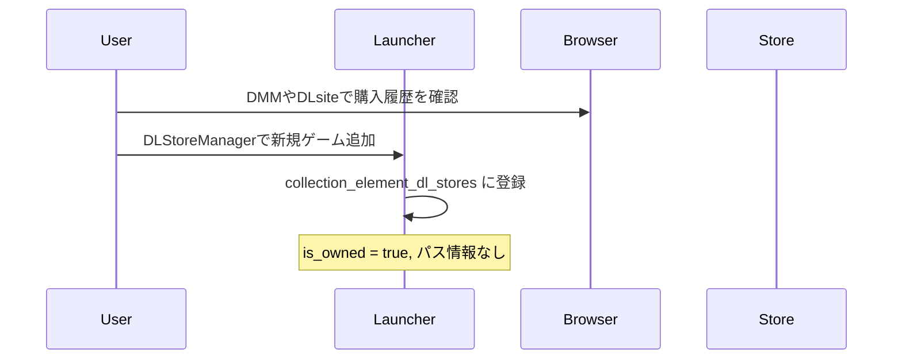
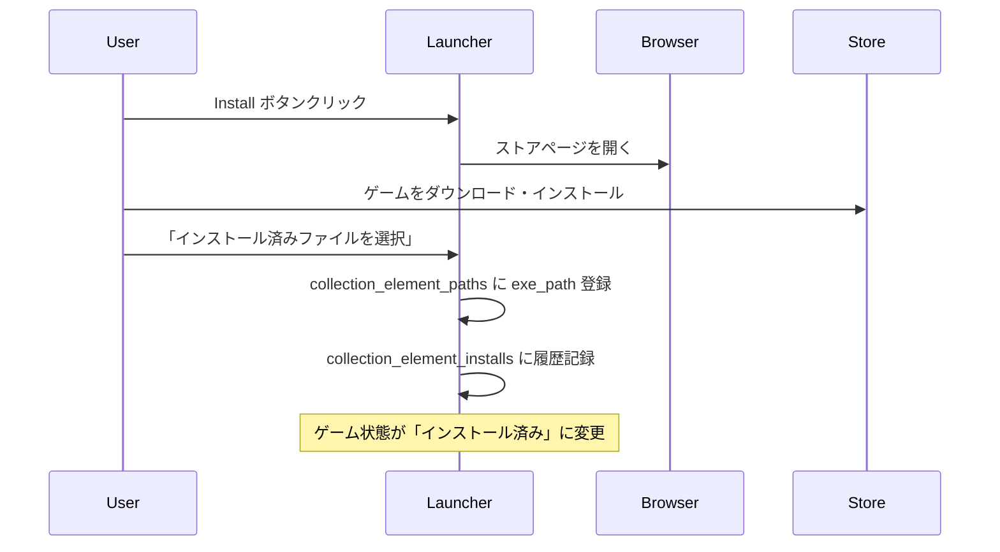

# DL版ゲーム管理機能デザインドキュメント

## 概要

Launchergにおいて、DMMやDLsiteで購入したダウンロード版ゲームを管理し、ユーザーが購入済みゲームのインストール・起動を効率的に行えるようにする機能を設計する。

## 目標

- 購入済みDL版ゲームのリスト表示
- 未インストールゲームに対するInstallボタンの提供
- インストール済みゲームに対するPlayボタンの提供
- ブラウザベースでのデータ同期（認証情報を保持しない）

## システム要件

### 機能要件

1. **DL版ゲーム情報の管理**
   - 購入済みゲームのメタデータ保存
   - インストール状態の追跡
   - 販売サイト情報の関連付け

2. **UI/UX**
   - 既存のPlayボタンと統一された見た目のInstallボタン
   - インストール状態に応じたボタンの自動切り替え
   - 購入済みゲームの視覚的識別

3. **ブラウザ連携**
   - DMMやDLsiteのゲームページへの直接リンク
   - ユーザーが手動でダウンロード・インストールを実行

### 非機能要件

- セキュリティ：認証情報を保持しない
- プライバシー：ユーザーの購入履歴は本人が管理
- 拡張性：新しい販売サイトの追加が容易

## アーキテクチャ設計

### 現在のCollectionElementアーキテクチャ

現在のLaunchergは、ゲーム管理において非常に優れた設計を採用しています：

- `CollectionElement`: ゲームの基本エンティティ（id, created_at, updated_atのみ）
- 関連情報は専用テーブルに分離：
  - `collection_element_info_by_erogamescape`: ゲーム情報
  - `collection_element_paths`: ファイルパス情報
  - `collection_element_installs`: インストール履歴
  - `collection_element_plays`: プレイ履歴
  - `collection_element_likes`: いいね履歴
  - `collection_element_thumbnails`: サムネイル情報

### データモデル設計

既存のパターンに従い、DL版ゲーム情報も関連エンティティとして追加します。

#### CollectionElementDLStore（新規）
```rust
#[derive(new, Debug, Clone, Serialize, Deserialize, PartialEq)]
#[serde(rename_all = "camelCase")]
pub struct CollectionElementDLStore {
    pub id: Id<CollectionElementDLStore>,
    pub collection_element_id: Id<CollectionElement>,
    pub store_id: String,        // DMMやDLsiteでのゲームID
    pub store_type: DLStoreType,
    pub store_name: String,      // 表示用ストア名
    pub purchase_url: String,    // ゲームページのURL
    pub is_owned: bool,          // 購入済みかどうか
    pub purchase_date: Option<DateTime<Local>>, // 購入日（わかる場合）
    pub created_at: DateTime<Local>,
    pub updated_at: DateTime<Local>,
}

#[derive(Debug, Clone, Serialize, Deserialize, PartialEq)]
pub enum DLStoreType {
    DMM,
    DLSite,
    // 将来的にSteam, Epic等も追加可能
}
```

#### CollectionElement構造（変更なし）
```rust
pub struct CollectionElement {
    pub id: Id<CollectionElement>,
    pub created_at: DateTime<Local>,
    pub updated_at: DateTime<Local>,
    // 関連データ
    pub info: Option<CollectionElementInfo>,
    pub paths: Option<CollectionElementPaths>,
    pub install: Option<CollectionElementInstall>,
    pub play: Option<CollectionElementPlay>,
    pub like: Option<CollectionElementLike>,
    pub thumbnail: Option<CollectionElementThumbnail>,
    pub dl_store: Option<CollectionElementDLStore>, // 新規追加
}
```

### データベース設計

#### 新規テーブル：collection_element_dl_stores
```sql
CREATE TABLE IF NOT EXISTS collection_element_dl_stores (
    id INTEGER PRIMARY KEY AUTOINCREMENT,
    collection_element_id INTEGER NOT NULL,
    store_id TEXT NOT NULL,
    store_type TEXT NOT NULL, -- 'DMM', 'DLSite'
    store_name TEXT NOT NULL,
    purchase_url TEXT NOT NULL,
    is_owned BOOLEAN NOT NULL DEFAULT FALSE,
    purchase_date DATETIME,
    created_at DATETIME DEFAULT CURRENT_TIMESTAMP,
    updated_at DATETIME DEFAULT CURRENT_TIMESTAMP,
    UNIQUE(collection_element_id, store_id, store_type),
    FOREIGN KEY(collection_element_id) REFERENCES collection_elements(id) ON DELETE CASCADE
);
```

### 統合的なゲーム状態管理

この設計により、1つのゲームに対して以下の状態管理が可能になります：

#### ゲームの存在形態パターン
1. **ローカルのみ**: `collection_element_paths`のみ存在
2. **DL版のみ**: `collection_element_dl_stores`のみ存在
3. **両方**: 両方のテーブルにデータが存在（同じゲームを複数形態で所有）

#### インストール状態の判定ロジック
1. `collection_element_paths.exe_path`または`lnk_path`が存在 → インストール済み
2. `collection_element_dl_stores.is_owned = true`かつパス情報なし → 未インストール
3. 上記以外 → 購入していない/情報なし

#### ボタン表示ロジック
- **Playボタン**: インストール済みの場合
- **Installボタン**: DL版を所有しているが未インストールの場合
- **非表示**: 所有していない場合

### バックエンド実装

#### Repository層
既存の`CollectionRepository`を拡張してDL版情報を扱います：

```rust
// domain/repository/collection.rs
pub trait CollectionRepository {
    // 既存メソッド...

    // DL版情報関連の新規メソッド
    async fn create_dl_store(&self, dl_store: &NewCollectionElementDLStore) -> Result<CollectionElementDLStore>;
    async fn find_dl_store_by_collection_element_id(&self, id: Id<CollectionElement>) -> Result<Option<CollectionElementDLStore>>;
    async fn update_dl_store(&self, dl_store: &CollectionElementDLStore) -> Result<()>;
    async fn delete_dl_store(&self, id: Id<CollectionElementDLStore>) -> Result<()>;
    async fn find_uninstalled_owned_games(&self) -> Result<Vec<CollectionElement>>;
}
```

#### UseCase層
既存の`CollectionUseCase`を拡張：

```rust
// usecase/collection.rs
impl CollectionUseCase {
    // 統合されたゲーム状態取得
    pub async fn get_game_with_install_status(&self, id: Id<CollectionElement>) -> Result<GameWithStatus> {
        let element = self.repository.find_by_id(id).await?;
        let paths = self.repository.find_paths_by_collection_element_id(id).await?;
        let dl_store = self.repository.find_dl_store_by_collection_element_id(id).await?;

        let status = self.determine_game_status(&paths, &dl_store);
        Ok(GameWithStatus { element, status })
    }

    // ゲーム状態判定ロジック
    fn determine_game_status(&self, paths: &Option<CollectionElementPaths>, dl_store: &Option<CollectionElementDLStore>) -> GameStatus {
        match (paths, dl_store) {
            (Some(paths), _) if paths.exe_path.is_some() || paths.lnk_path.is_some() => GameStatus::Installed,
            (None, Some(dl_store)) if dl_store.is_owned => GameStatus::OwnedNotInstalled,
            _ => GameStatus::NotOwned,
        }
    }

    // DL版ゲーム登録
    pub async fn register_dl_store_game(&self, request: RegisterDLStoreGameRequest) -> Result<()> {
        // 既存のcollection_elementを検索または作成
        // DL版情報を登録
    }

    // インストール済みパスの関連付け
    pub async fn link_installed_path(&self, collection_element_id: Id<CollectionElement>, exe_path: String) -> Result<()> {
        // pathsテーブルにデータを挿入
        // installsテーブルに履歴を記録
    }
}

#[derive(Debug)]
pub enum GameStatus {
    Installed,           // プレイ可能
    OwnedNotInstalled,   // インストール可能
    NotOwned,           // 購入していない
}
```

#### Interface層
Tauriコマンドを追加：

```rust
// interface/command.rs
#[tauri::command]
pub async fn get_games_with_status(app_handle: AppHandle) -> Result<Vec<GameWithStatus>, String> {
    // 統合されたゲーム一覧を返す
}

#[tauri::command]
pub async fn register_dl_store_game(
    app_handle: AppHandle,
    store_type: String,
    store_id: String,
    game_title: String,
    purchase_url: String
) -> Result<(), String> {
    // DL版ゲームを登録
}

#[tauri::command]
pub async fn open_store_page(purchase_url: String) -> Result<(), String> {
    // ブラウザでストアページを開く
    open::that(purchase_url).map_err(|e| e.to_string())
}

#[tauri::command]
pub async fn link_installed_game(
    app_handle: AppHandle,
    collection_element_id: i64,
    exe_path: String
) -> Result<(), String> {
    // インストール済みゲームとDL版情報を関連付け
}
```

### フロントエンド実装

#### 既存コンポーネント拡張

1. **PlayButton.svelte拡張**
   既存のPlayButtonコンポーネントにゲーム状態に応じたボタン表示機能を追加：

   ```typescript
   // props
   export let collectionElement: CollectionElement
   export let gameStatus: 'installed' | 'owned-not-installed' | 'not-owned'

   // ボタン表示ロジック
   $: buttonConfig = getButtonConfig(gameStatus, collectionElement)

   function getButtonConfig(status: string, element: CollectionElement) {
     switch (status) {
       case 'installed':
         return { text: 'Play', action: () => playGame(element), variant: 'primary' }
       case 'owned-not-installed':
         return { text: 'Install', action: () => openStorePage(element.dl_store.purchase_url), variant: 'secondary' }
       default:
         return null // ボタンを表示しない
     }
   }
   ```

2. **Work.svelte拡張**
   DL版情報を表示するセクションを追加：

   ```svelte
   <!-- 既存のゲーム情報表示に加えて -->
   {#if work.dl_store}
     <div class='dl-store-info'>
       <h3>DL版情報</h3>
       <p>ストア: {work.dl_store.store_name}</p>
       <p>購入日: {work.dl_store.purchase_date || '不明'}</p>
       {#if work.dl_store.is_owned && !isInstalled}
         <LinkButton href={work.dl_store.purchase_url} target='_blank'>
           ストアページを開く
         </LinkButton>
       {/if}
     </div>
   {/if}
   ```

#### 新規コンポーネント

1. **DLStoreManager.svelte**
   DL版ゲームの一括管理画面：

   ```svelte
   <script lang='ts'>
     import { invoke } from '@tauri-apps/api/tauri'

     let uninstalledGames: GameWithStatus[] = []
     let newGameForm = { storeType: 'DMM', storeId: '', gameTitle: '', purchaseUrl: '' }

     async function loadUninstalledGames() {
       uninstalledGames = await invoke('get_uninstalled_owned_games')
     }

     async function registerNewGame() {
       await invoke('register_dl_store_game', newGameForm)
       await loadUninstalledGames()

   </script>

   <div class='dl-store-manager'>
     <section>
       <h2>未インストールの購入済みゲーム</h2>
       {#each uninstalledGames as game}
         <div class='game-item'>
           <span>{game.info?.gamename || 'タイトル不明'}</span>
           <Button on:click={() => invoke('open_store_page', { purchaseUrl: game.dl_store.purchase_url })}>
             Install
           </Button>
         </div>
       {/each}
     </section>

     <section>
       <h2>新しいDL版ゲームを追加</h2>
       <!-- ゲーム登録フォーム -->
     </section>
   </div>
   ```

2. **InstallDetector.svelte**
   インストール検出とパス関連付け機能：

   ```svelte
   <script lang='ts'>
     import { open } from '@tauri-apps/api/dialog'
     import { invoke } from '@tauri-apps/api/tauri'

     export let collectionElementId: number

     async function selectInstallPath() {
       const selected = await open({
         filters: [{ name: 'Executable', extensions: ['exe'] }]
],
       }

       if (selected) {
         await invoke('link_installed_game', {
           collectionElementId,
           exePath: selselected,
         }
          成功通知とUI更新
       }
     }
   </script>

   <Button on:click={selectInstallPath}>
     インストール済みファイルを選択
   </Button>
   ```

### データ同期フロー

#### 1. DL版ゲーム情報の登録


#### 2. インストールフロー


#### 3. 自動検出の拡張可能性
将来的に自動検出機能を追加する場合：

- **ファイルシステム監視**: よく使われるインストールディレクトリを監視
- **レジストリ検索**: Windowsのアンインストール情報から検出
- **ショートカットスキャン**: デスクトップやスタートメニューのショートカットを解析

#### 4. データの整合性管理
- ユーザーが手動でゲームをアンインストールした場合の検出
- 存在しないパスの自動クリーンアップ
- 重複登録の防止機能

## 実装段階

### Phase 1: バックエンド基盤実装
1. **データベーススキーマ追加**
   - `collection_element_dl_stores`テーブルのマイグレーション作成
   - SQLxクエリの追加

2. **ドメインモデル実装**
   - `CollectionElementDLStore`構造体の追加
   - `DLStoreType` enumの定義
   - 関連するNew/Update構造体

3. **Repository層拡張**
   - `CollectionRepository`にDL版関連メソッド追加
   - SQLx実装の追加

4. **UseCase層拡張**
   - ゲーム状態判定ロジックの実装
   - DL版ゲーム登録・更新機能
   - パス関連付け機能

### Phase 2: Tauri Interface実装
1. **Tauriコマンド追加**
   - `register_dl_store_game`
   - `get_games_with_status`
   - `open_store_page`
   - `link_installed_game`

2. **エラーハンドリング**
   - 各コマンドの適切なエラー処理
   - フロントエンドへのエラー通知

### Phase 3: フロントエンド実装
1. **既存コンポーネント拡張**
   - `PlayButton.svelte`の状態別表示機能
   - `Work.svelte`のDL版情報表示

2. **新規管理画面**
   - `DLStoreManager.svelte`による一括管理
   - 設定画面への統合

3. **ユーザーエクスペリエンス向上**
   - インストール状態の視覚的フィードバック
   - ブラウザ連携の使いやすさ改善

### Phase 4: テスト・品質保証
1. **単体テスト**
   - Repository層のテスト
   - UseCase層のロジックテスト

2. **統合テスト**
   - Tauriコマンドのエンドツーエンドテスト
   - データベース整合性テスト

3. **ユーザビリティテスト**
   - 実際のワークフローでの検証
   - パフォーマンス確認

## セキュリティ考慮事項

- 認証情報は一切保存しない
- ブラウザ起動時はユーザーの明示的な操作のみ
- ファイルパス情報は暗号化して保存（将来的検討）

## 今後の拡張可能性

- Steam、Epic Games Store等の対応
- 自動インストール検出の精度向上
- クラウド同期機能（オプション）
- 統計・レポート機能

## リスク

- ブラウザAPI変更によるデータ取得方法の影響
- 販売サイト側の仕様変更
- ユーザーの手動操作に依存する部分の使いやすさ

## まとめ

### 設計の優位性

1. **既存アーキテクチャとの整合性**
   - CollectionElementを中心とした既存の優れた設計を維持
   - 新機能も同じパターンで実装し、コードベースの一貫性を保持

2. **柔軟性と拡張性**
   - 単一のゲームが複数の形態（ローカル・DL版）で存在することに対応
   - 新しいストア（Steam、Epic等）の追加が容易な設計

3. **セキュアな設計**
   - 認証情報を保持せず、ユーザーのプライバシーを保護
   - ブラウザ連携により安全なデータ同期を実現

4. **ユーザーエクスペリエンス**
   - 既存のPlay機能との統一的なインターフェース
   - 直感的なInstall/Playボタンの切り替え

### 期待される成果

本設計の実装により、Launchergユーザーは：
- ローカルゲームとDL版ゲームを統一的に管理可能
- 購入済みゲームのインストール状況を一目で把握
- セキュアな方法でDL版ゲーム情報を同期
- 既存の操作感を維持しながら新機能を利用

この設計は、現在の優れたアーキテクチャを活かしつつ、ユーザーの新しいニーズに応える拡張可能なソリューションを提供します。
